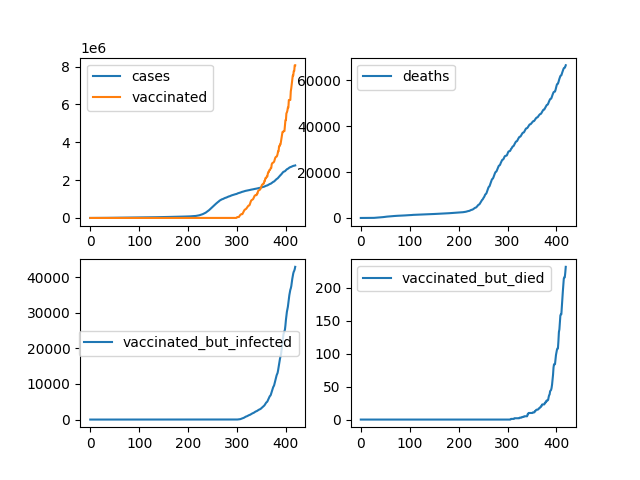

This COVID-19 simulation tries to asses how many vaccinated people might still
get infected and die before the immunity system fully kicks in.


How does it work
----------------
The basic building block o the simulation is a model of a population.
Individuals in a population have features which can evolve as the summation
runs, and thus creating subpopulations. Randomly picked individuals can be then
_affected_ (one or more of their features can change) in each simulation cycle.


Quick start
-----------
The simulation was tested under Ubuntu 20.04 with Python 3.8.5. After installing
requirements from `requirements.txt`, it can be started with:

```
./simulation.py --location Poland
```


Limitations
-----------
There are number of known (and probably some unknown) limitations that you
should be aware of. Make sure you understand them before interpreting any of
this.

Things that might cause the numbers to be underestimated:

- For the program, a _protected_ (one that cannot be infected) person is
  everyone two weeks after the first dose of the vaccine.

- In many countries, people in the high risk groups were prioritized to take
  the jabs first, making them overrepresented in the vaccinated subpopulation.
  This might paradoxically mean that the vaccinated subpopulation is
  **at first**, more susceptible to severe complication.

- By default, infected people are not vaccinated. This is only partially true
  because there might be people who did catch the infection say a day before
  the vaccination. You can change this behavior to vaccinate despite the 
  infection by `--vaccinate-despite-infection`.


Data
----
The data was taken from https://ourworldindata.org/ and added to the repository.
It can be updated with:

```
wget https://covid.ourworldindata.org/data/owid-covid-data.csv
```


Sample results
--------------
Simulation performed with data from the beginning of the pandemic
to 28 April 2021:



This is what happens if we allow infected people to be vaccinated:

