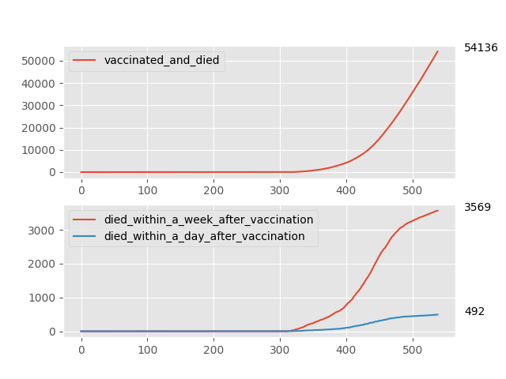

How does it work
----------------
The simulation is written in Python and it was tested under Ubuntu 20.04 with
Python 3.8.5. `requirements.txt` contains a list of dependencies.

The basic building block o the simulation is a model of a population.
Individuals in a population have features which can evolve as the summation
runs, and thus creating subpopulations. Randomly picked individuals can be then
_affected_ (one or more of their features can change) in each simulation cycle.


Data
----
The data about daily cases, deaths and vaccinations was taken from
https://ourworldindata.org/ and added to the repository.

It can be updated with:

```
wget https://covid.ourworldindata.org/data/owid-covid-data.csv
```


How many people would die even after getting a shot of NaCl solution?
---------------------------------------------------------------------
While it is obvious that no vaccine makes you immortal and therefore some
vaccinated people will die shorty after getting a shot. This simulation tries
to estimate a number of such occurrences to see whether number of serious
adverse events can be based on the time correlation alone.

The algorithm works as follow. First, it constructs a virtual population of around 40M
people. Then, for each day the data exists for, it randomly picks two groups of
people. First group is getting vaccinated and the second dies. Number of
vaccinated people is taken from OWID data, and number of people who die is
always 1000, which is a understated number of daily deaths in Poland.

Dates for both events are recoded for each affected person and two sets are
built out of them: people who died within a week after taking a vaccine and
people who died next day after.

The simulation can be started with:

```
./how-people-would-die.py --plot plot.png
```

These are the result for a simulation For the OWID data up to 17 Aug 2021:




How many people are expected to get infected after vaccination?
---------------------------------------------------------------
This COVID-19 simulation tries to asses how many vaccinated people might still
get infected and die before the immunity system fully kicks in.

It can be started by:

```
./simulate.py --location Poland --plot plot.png
```

`--plot` can be skipped to see the raw computed data instead.


There are number of known (and probably some unknown) limitations that you
should be aware of. Make sure you understand them before interpreting any of
this.

Things that might cause the numbers to be underestimated:

- For the program, a _protected_ person is everyone two weeks after the first
  dose of the vaccine. In other words, no one can be infected two weeks after
  vaccination, which obviously isn't the case in the real world.

- In many countries, people in the high risk groups were prioritized to take
  jabs first, making them overrepresented in the vaccinated subpopulation.

- By default, infected people are not vaccinated. This is only partially true
  because there might be people who did catch the infection say a day before
  the vaccination. You can change this behavior to vaccinate despite the 
  infection by `--vaccinate-despite-infection`.


Simulation performed with data from the beginning of the pandemic
to 28 April 2021:


This is what happens if we allow infected people to be vaccinated:


